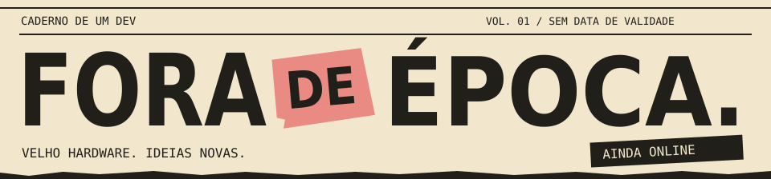
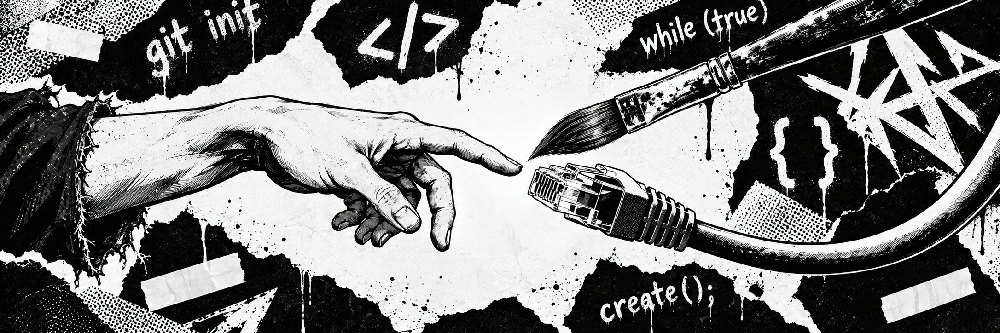
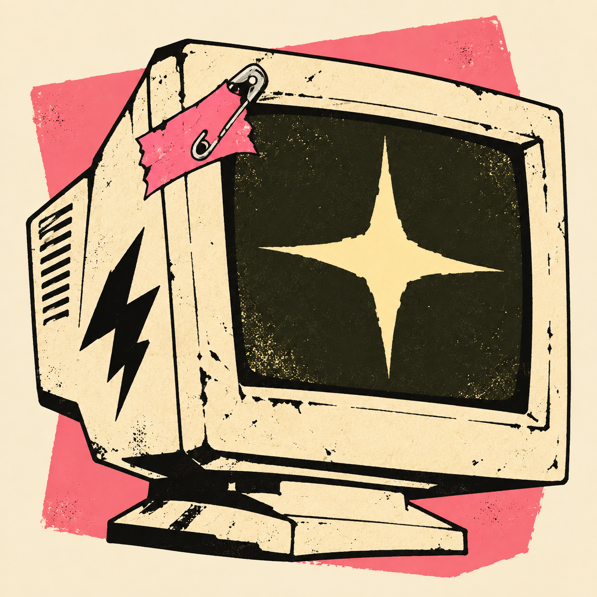

<!-- FORA DE ÉPOCA — perfil pessoal. Edite este README diretamente ou use perfil.json + scripts/montar.py. -->

   
  

  <strong>e.</strong>

Apaixonado pela arte e estudante da área de TI. Gosto de construir coisas para a web, experimentar ideias e dar personalidade ao que aparece na tela.

  
  &nbsp;
  

 

<h2></h2>

### Interfaces com personalidade

Sites, pequenos sistemas e experiências visuais. Do primeiro rascunho ao ajuste que faz tudo encaixar.

### Ideias que viram ferramentas

Testes com código e IA, automações e projetos que começam com um “será que dá?”.

Tem coisa pronta, coisa em teste e coisa esperando uma tarde livre.

 

  
<strong>LADO B</strong> — quando fecho o editor

 

Computadores antigos, desenho, mundos inventados e a vontade de entender como as coisas funcionam. Gosto de projetos que deixam aparecer a personalidade de quem os fez.

  

<em>O computador mudou. A vontade de mexer em tudo, não.</em>

 

  

