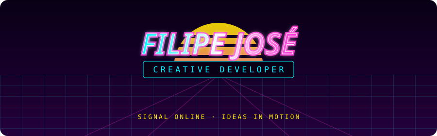

<div align="center">



<br>

<a href="https://github.com/soueuFilipeJose?tab=repositories">
  
</a>


</div>

```text
┌─[ C:\USERS\FILIPE ]───────────────────────────────────────[ ● ONLINE ]─┐
│                                                                          │
│  > WHOAMI                                                               │
│    Estudante de TI • Desenvolvedor criativo • Construtor de mundos      │
│                                                                          │
│  > CURRENT_MISSION                                                       │
│    Transformar ideias improváveis em experiências digitais reais.       │
│                                                                          │
└──────────────────────────────────────────────────────────────────────────┘
```

## `01 // SOBRE_MIM`

Desenvolvo na interseção entre **código, design e imaginação**. Gosto de criar interfaces com identidade, sistemas para RPG e experiências usando inteligência artificial — sempre buscando algo que pareça menos genérico e mais vivo.

- 🕹️ Construindo projetos web e ferramentas interativas
- 🎲 Criando sistemas, mundos e interfaces para RPG
- 🤖 Explorando IA generativa além dos chatbots
- 📡 Aprendendo, testando e publicando cada nova descoberta

## `02 // SISTEMAS_EM_EXECUÇÃO`

| CANAL | SINAL |
|:--|:--|
| `WEB` | Interfaces responsivas e experiências digitais |
| `RPG` | Fichas, regras, balanceamento e construção de mundos |
| `IA` | Imagens, vídeos, automações e software criativo |
| `LAB` | Projetos experimentais que misturam tecnologia e arte |

## `03 // TECH_DECK`

<div align="center">


</div>

## `04 // TRANSMISSÃO`

```js
const filipe = {
  role: "creative developer",
  coordinates: "Brazil",
  fuel: ["curiosity", "design", "technology"],
  building: ["web experiences", "RPG systems", "AI experiments"],
  motto: "Se consigo imaginar, posso aprender a construir."
};
```

<div align="center">

### `PRESS START TO EXPLORE`

<a href="https://github.com/soueuFilipeJose?tab=repositories">
  
</a>

<br><br>


<sub>© 198X–PRESENTE · SINAL TRANSMITIDO DIRETAMENTE DO FUTURO</sub>

</div>
