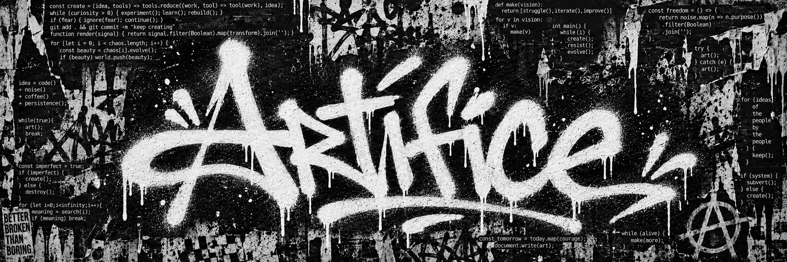
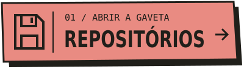
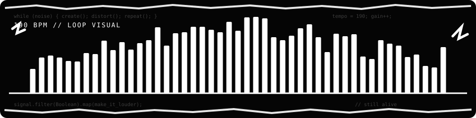

<!-- FORA DE ÉPOCA — perfil pessoal. Edite este README diretamente ou use perfil.json + scripts/montar.py. -->

   

<h4>
  Olá mundo, meu nome é Filipe, sou um fleumático apaixonado pela arte e pela tecnologia, e claro estudante da área de TI. Gosto de criar coisas, experimentar ideias e aprender fazendo isso, e dar personalidade ao que aparece na tela.</h4>

  
  &nbsp;
  

 

# Interfaces com personalidade

Sites, pequenos sistemas e experiências visuais. Do primeiro rascunho ao ajuste que faz tudo se encaixar.

# Ideias que viram repositórios
<ul>
<li>Testes com código e IA;</li>
<li>Projetos desenvolvidos na sala de aula;</li>
<li>Estudos complexos;</li>
<li>Automações e projetos que começam com um “será que dá?”.</li>
</ul>

Computadores antigos, desenho, mundos inventados e a vontade de entender como as coisas funcionam. Gosto de projetos que deixam aparecer a personalidade de quem os fez.

~Tem coisa pronta, coisa em teste e coisa esperando uma tarde livre...

  

